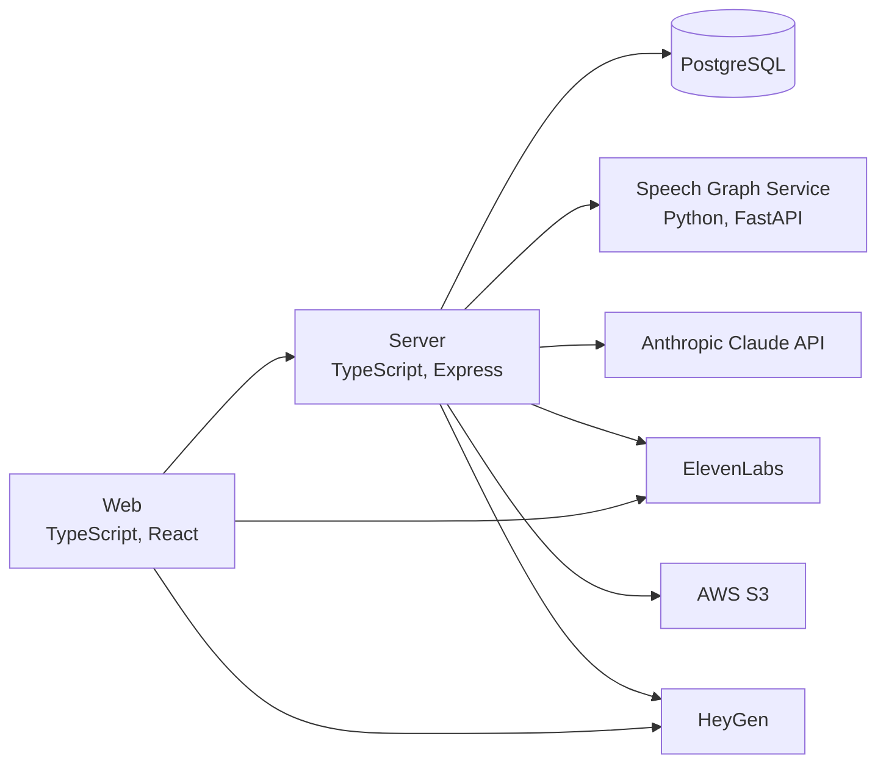

# Patronum

Patronum is a web platform where dementia patients join simulated Cognitive Stimulation Therapy group sessions with an AI moderator and AI participants, while caregivers assign sessions and follow progress on an analytics dashboard. Claude drives the moderator and participants, ElevenLabs and HeyGen give them voices and video avatars, a Python service scores speech graphs from session transcripts, and the project was a TreeHacks 2026 entry.

